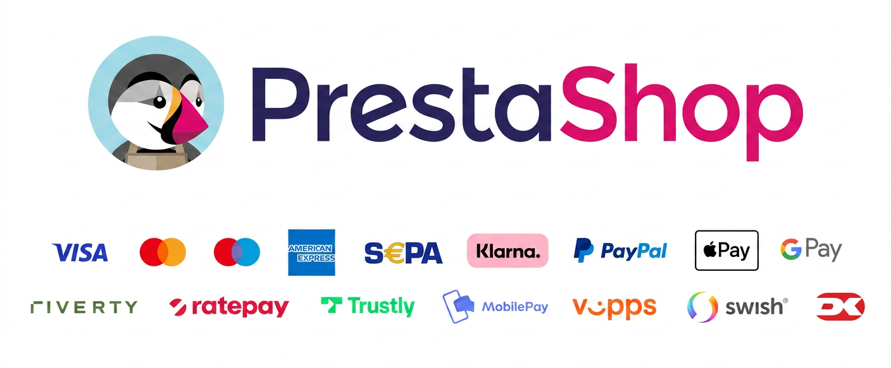

# Nexi Checkout for PrestaShop

A native payment module for PrestaShop that integrates the Nexi Checkout payment gateway. It supports Hosted and Embedded checkout flows, automatic webhook synchronization, and full back-office payment management (capture, refund, cancel). 

**System Requirements:**
- PrestaShop 8.2 or newer
- PHP 8.2 or newer
- HTTPS enabled

## Table of Contents

- [1. Before you start](#1-before-you-start)
- [2. Overview](#2-overview)
- [3. Main capabilities](#3-main-capabilities)
- [4. Installation](#4-installation)
   - [Option A: Install from a release package](#option-a-install-from-a-release-package)
   - [Option B: Install from source (GitHub)](#option-b-install-from-source-github)
- [5. Configuration steps](#5-configuration-steps)
- [6. Payment method splitting](#6-payment-method-splitting)
- [7. Klarna](#7-klarna)
- [8. Go live checklist](#8-go-live-checklist)
- [9. Troubleshooting](#9-troubleshooting)
   - [A. Nexi payment option is missing at checkout](#a-nexi-payment-option-is-missing-at-checkout)
   - [B. Nexi payment window is blank](#b-nexi-payment-window-is-blank)
   - [C. Payments in live mode don't work](#c-payments-in-live-mode-dont-work)
- [10. See also](#10-see-also)

## 1. Before you start

> Before you start, you need a Checkout Portal account. See the guide [Create account](https://developer.nexigroup.com/nexi-checkout/en-EU/docs/create-a-checkout-portal-account/) for more information about creating a free test account.

## 2. Overview

Our PrestaShop module is the perfect extension to enable Nexi Checkout to its full potential for your store. Checkout supports the most popular payment methods.

Depending on your country or region, the list may vary. If you are uncertain about a specific payment method and whether it is available in your country or region, please [contact Support](https://developer.nexigroup.com/nexi-checkout/en-EU/support/) for more information.



## 3. Main capabilities

- Hosted and Embedded checkout flows
- Test and Live mode configuration
- Multistore support
- Automatic webhook synchronization of payment events
- Capture, partial capture, refund, partial refund, and cancel actions from order admin
- Payment method splitting (show one combined Nexi option or separate payment options)

## 4. Installation

Use one of the methods below.

### Option A: Install from a release package

1. Download the module release package.
2. In PrestaShop Admin, open Modules > Module Manager.
3. Upload and install the module package.

### Option B: Install from source (GitHub)

1. Connect with an SSH client and navigate to the root directory of your PrestaShop installation.
2. Clone this repository into the `modules` directory:

```bash
git clone <repository-url> modules/nexi_checkout
```

3. Install PHP dependencies for the module:

```bash
cd modules/nexi_checkout
composer install --no-dev -o
```

4. In PrestaShop Admin, go to Modules > Module Manager.
5. Find Nexi Checkout and click Install (or Enable).

The module is now installed and ready to be configured for your Checkout account.

## 5. Configuration steps

1. Go to Modules > Module Manager.
2. Find Nexi Checkout and click Install, once the module is installed click Configure.
3. Fill all required text fields, and change default values of other fields if needed. 
Live and test keys can be found in Nexi Checkout Portal -> Integrations.
   - Live secret key
   - Live checkout key
   - Test secret key
   - Test checkout key
   - Enable auto-charge
   - Enable live mode
   - Checkout flow
   - Payment method splitting
   - Payment Methods
   - Terms URL (must start with https://)
   - Cookie Terms URL
   - Webhook Secret Code
4. Save configuration.

Both integration keys can be found in the Checkout Portal. See the following pages for more help:
- [Where can I find my merchant number (merchant ID)?](https://developer.nexigroup.com/nexi-checkout/en-EU/support/where-can-i-find-my-merchant-number-merchant-id/)
- [Access your integration keys](https://developer.nexigroup.com/nexi-checkout/en-EU/docs/access-your-integration-keys/)

## 6. Payment method splitting
When enabled, each payment method appears as a separate option at checkout. When disabled, all methods are shown in a single Nexi Checkout option.

1. On the configuration screen, toggle the `Payment method splitting` switch to `Yes`
2. Enable and rearrange desired payment methods by dragging and dropping them using the icon on the left .

## 7. Klarna

For Klarna to appear correctly in the Nexi Group payment window, the customer’s phone number must be collected during checkout.

In PrestaShop, the phone number field is part of the customer address form, but it may not be required by default. To make it required, follow these steps:
1. Navigate to `Customers > Addresses`.
2. Click `Set required fields for this section` button on the bottom left of the page.
3. From the list select `phone` and click on `Save`.

To learn more, visit the PrestaShop documentation.

## 8. Go live checklist

Use this checklist before enabling Live mode:
- Test mode transaction works end-to-end
- Capture and refund actions verified
- Webhook delivery confirmed
- Payment methods validated for your markets/currencies
- At least one real-like order scenario tested

For more information, refer to the section [Go-live checklist](https://developer.nexigroup.com/nexi-checkout/en-EU/docs/go-live-checklist/).

## 9. Troubleshooting

Below are some of the most common configuration errors, their cause, and steps that you can follow to solve them.

### A. Nexi payment option is missing at checkout

Check:
- Module is installed and enabled.
- Configuration is saved for the active shop (especially in multistore).
- API keys are present and valid for the selected mode.
- Payment methods are available for the customer currency/country in your Nexi agreement.

### B. Nexi payment window is blank
- Ensure your integration keys are correct and do not contain additional blank spaces.
- Temporarily deactivate third-party modules that might affect the functionality of the module.
- Check if there are any temporary technical inconsistencies: [Operational Status](https://easy-status.developers.nets.eu/)

### C. Payments in live mode don't work
- Ensure you have an approved Live Checkout account for production.
- Ensure your Live Checkout account is approved for payments with the selected currency.
- Ensure payment method data is correct and supported by your Checkout agreement.

## 10. See also
- [Create account](https://developer.nexigroup.com/nexi-checkout/en-EU/docs/create-a-checkout-portal-account/)
- [Test payment data](https://developer.nexigroup.com/nexi-checkout/en-EU/docs/test-data/)
- [Test environment](https://developer.nexigroup.com/nexi-checkout/en-EU/docs/test-environment/)
- [Test card processing](https://developer.nexigroup.com/nexi-checkout/en-EU/docs/test-card-processing/)
- [Test invoice & installment processing](https://developer.nexigroup.com/nexi-checkout/en-EU/docs/test-invoice-installment-processing/)
- [Support](https://developer.nexigroup.com/nexi-checkout/en-EU/support/)